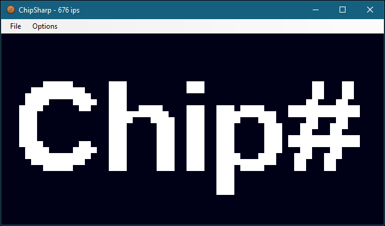

# ChipSharp
  

## About
ChipSharp is a [Chip-8](https://en.wikipedia.org/wiki/CHIP-8) Interpreter built in C# using Windows Forms. It is not yet feature complete.

## Prerequisites
* The .NET Runtime Version >= 4.7.2 needs to be installed on your system.
* ChipSharp primarily supports Windows at the moment, though you might be able to run it with Mono on other platforms. This has not been tested yet.

## Downloads
[Latest Release](https://github.com/Sairenity/ChipSharp/releases/latest)

## Building
ChipSharp is a self-contained, standard C# Windows Forms project. It can be built using either JetBrains Rider or Visual Studio 2019.

## Features
* Full Chip-8 compatibility
* Freely assignable keybindings

## Planned Features
* Debugger
* Disassembler
* Ability to turn off beeps
